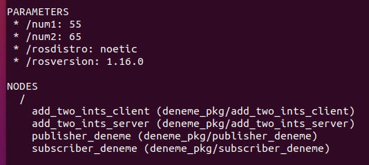

# Launch dosyaları Nedir ve Örnek Kullanım?

Bir projede birçok node bulunabilir. Bu nodeları terminale tek tek girmek pek de mantıklı olmaz. Bu yzüden launch dosyaları kullanmalıyız.Parametre tanımlarken node ların içine ***yazılmaması*** gerekiyor.

```xml
<launch>

	<param name="num1" type="int" value="16" />
	<param name="num2" type="int" value="5" />

	<node pkg="deneme_pkg" type="add_two_ints_client" name="add_two_ints_client" output="screen">	
	</node>
	<node pkg="deneme_pkg" type="add_two_ints_server" name="add_two_ints" output="screen">
	</node>
	<node pkg="deneme_pkg" type="publisher" name="publisher" output="screen">
	</node>
	<node pkg="deneme_pkg" type="subscriber" name="subscriber" output="screen">
	</node>
</launch>
```

launch dosyasını çalıştırmak için roscore un çalışmasına gerek yok zaten roslaunch da roscore un özelleşmiş halidir.bu sayede launch dosyasındaki tğm nodelar çalışmış olacak 

```bash
roslaunch deneme_pkg dosyaIsmi.launch 
```



