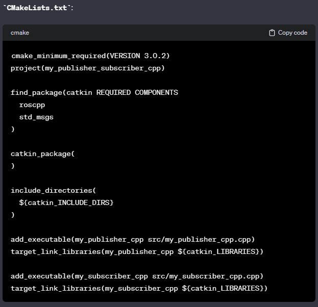

# Publisher-Subscriber Nodeları Oluşturmak

Öncellikle paket olası tüm paketler için bir workspace oluşturmamız gerekiyor ve bu klasorün içinde de oluşturacağımız tüm paketlerin yer alacağı src klasoru oluşturmamız gerekiyor.

```bash
mkdir -p pubsub_ws/src
```

ardından src klasorunun içindeyken catkin_create_pkg ile paket oluşturulur ve gerekli bağlımlıklar belirilir. Önce paketin ismi sonra da bağlı olduğu diğer paketler yazılır

```bash
catkin_create_pkg pubsub_pkg rospy roscpp std_msgs
```

pub_sub_ws klasorunde iken catkin_make ile paket derlemesi tamamlanır. 2 adet yeni klasor oluşturulur. toplamda build devel ve src klasorlerimiz olur.

Ardından src klasörunun içerisindeki oluşturduğumuz klasorun içine girdikten sonra c++ kodlarımızı yazmak için yeni bir src klasoru oluşturuyoruz ve bu klasore publisher ve subscriber node larımızı yazacağız. src klasorunde başka klasorlerde ekleyebiliriz. Mesela python ile node oluşturacaksak script, c++ da header dosyaları kullanacaksak include … şeklinde yönetimi kolaylaştırmak için klasor hiyerarşisini kullanabiliriz.

src klasorundeykin   ***touch publisher.cpp*** terminal kodu ile boş bir cpp dosyası oluşturuyoruz. ardından bu dosyaya gerekli kodları yazmamız gerekiyor.

```cpp
//PUBLISHER NODE 
#include "ros/ros.h"
#include "std_msgs/String.h"

using namespace ros;//bu sayede ros:: yazmaya gerek kalmaz.ama genelde kullanırlar.
int main(int argc,char**argv){

	ros::init(argc,argv,"publisher");

	NodeHandle nh;
	
	ros::Publisher pub=nh.advertise<std_msgs::String>("subpub_topic_cpp",10);
	ros::Rate rate(1);//frekenası belirtir.

	while(ros::ok()){
	std_msgs::String msg;
	msg.data="Yayinlanacak olan data bu ifadedir.";//eğer bu ifadeye bir sayı ekleyeceksek onu to_string ile eklemeliyiz
	pub.publish(msg);
	rate.sleep();
	}
	return 0;
}
```

```cpp
#include "ros/ros.h"
#include "std_msgs/String.h"
//SUBSCRIBER NODE 
using namespace ros;//bu sayede ros:: yazmaya gerek kalmaz.ama genelde kullanırlar.

void callback(const std_msgs::String::ConstPtr &msg){
	ROS_INFO("Publisher tarafından yayinlanan ve subscriber tarafinda alinan mesaj : %s",msg->data.c_str());//ROS_INFO==cout
}

int main(int argc,char**argv){
	ros::init(argc,argv,"subscriber");
	NodeHandle nh;
	ROS_INFO("Subscriber");//1 defa yazılır.
	Subcriber sub=nh.subscribe("subpub_topic_cpp",10,callback);//her data geldiğinde çağırılacak olan fonksiyonu veriyoruz.
	ros::spin();//işlemin sürekli devam etmesi için
return 0;
```

Bu işlemleri yaptıktan sonra CMakeList.txt ve package.xml dosyalarında bazı küçük değişiklikler yapacağız. Eğer biz node larımızı python ile yazmış olsaydık bu ek düzenlemeleri yapamamıza gerek yoktu.




---

Artık her şey hazır workspace i yaptığımız değişiklerden haber etmek için ilgili workspacede iken catkin_make yapmamız gerekiyor.

Şimdi roscore ile tüm haberleşmeyi başlattıktan sonra başka bir terminalde kodları çalıştırılır.

```cpp
rosrun pubsub_pkg publisher
// yeni bir terminalde 
rosrun pubsub_pkg subscriber 
i
```

Bu işlemden sonra bu paketi source lamamız gerekiyor.

```jsx
gedit ~/.bashrc //dosyayı açıyoruz ve bu paketin adresini eklememiz gerekiyor.yoksa paketimiz terminal de gözükmez.

source /home/kullaniciad/paketismi/devel/setup.bash // bu adresi açılan dosyanın sonuna ekliyoruz.
```


ilk önce publisher ın yayın yapması gerektiğini unutma.

eğer publisher yayın bırakırsa otomatik olarak subscriber a birşey gitmez. ve eğer devam ederse otomatik olarak devam eder


---