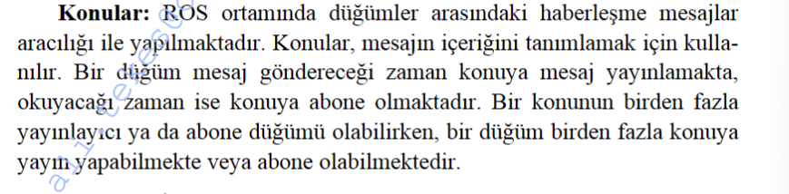

# ROS Kavramları

### ROSMASTER

Ros için kayıt merkezidir.Ortamdaki düğümlerin port bilgilerini mesaj bilgilerini gibi önemli bilgileri barındırır.Eğer bu düğüm olmaz ise düğümler birbirleriyle haberleşemez.

### Düğümler

Hesaplamaların gerçekleştiği proseslerdir.Düğümler kullanılarak geliştirilen sistemler sayesinde dağıtık bir yazılım mimarsi elde edilmektedir.Bu sayede bir düğüm çalışmazsa eğer diğer tüm düğümler çalışmaya devam edebilmektedir.

### Konular

### Servisler

İki düğüm arasında istemci/sunucu şeklinde senkron bir yapı kurulmak istendiğinde servisler kullanılır. Bu yapıda servise istek göndermekte ve servis den cavap gelene kadar istemci beklemektedir.

### ROSCORE

Düğümler arası mesajlaşmanın sağlandığı, log ların tutulduğu ana düğümdür. Ros kullanırken çalıştırılması gereken ilk komuttur. Bu sayede gerekli servislerin çalışmasını başlatır.