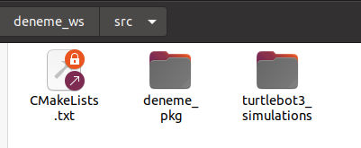

# TurtleBot3 u publisher ile kontrol etmek

İlk once turttlebot 3 u kendi ws imize implemente etmemiz gerekiyor. 



ardından deneme_pkg içerinde src içine bir tane publisher düğümü yazıyoruz. Robotun hareketini sağlayan mesaj tipi geometry_msgs olduğu için publisher düğümümüzüde buna uygun bir şekilde yazmamız gerekiyor.turtlebot3 twist tipindeki mesajlara göre hareket ediyor.

```cpp
#include "ros/ros.h"
#include "geometry_msgs/Twist.h"

using namespace ros;

int main(int argc,char**argv){
	init(argc,argv,"turtlebot_publisher")

	NodeHandle nh;
	Rate rate(10);
	Publisher pub=nh.advertise<geometry_msgs::Twist>("/cmd_vel",10);
	
	geometry_msgs::Twist move_cmd;
	move_cmd.linear.x=0.2;
	move_cmd.angular.y=0.2;

	while(ok()){
		pub.publish(move_cmd);
	}	
	rate.sleep();
}
```

ardından her publisher dan sonra olduğu gibi cmake ve package.xml de değişiklikler yapmamız gerekiyor. İlk başta geometry_msgs pakedini bağımlılık olarak eklemediğimiz için şimdi eklememiz gerekiyor. 

```cpp
//package.xml
<build_depend>geometry_msgs</build_depend>
<exec_depend>geometry_msgs</exec_depend>

//cmakelist.txt
find_package(catkin REQUIRED COMPONENTS
roscpp ... //diğer tum bağımlılıklar
geometry_msgs
)

catkin_package(
CATKIN_DEPENDS geometry_msgs
)

add_executable(turtlebot_publisher src/turtlebot_publisher.cpp)

target_link_libraries(turtlebot_publisher
${catkin_LIBRARIES}
)
```

şimdi artık her şey hazır. Gazebo ortamında görmek için 

```cpp
export TURTLEBOT3_MODEL=burger
roslaunch turtlebot3_gazebo turtlebot3_house.launch 
//diğer terminalde açmamız gerekiyor.
roscore 
//artık yazdığımız publisher düğümünü çalıştırmamız gerekiyor.
rosrun deneme_pkg turtlebot_publisher 
```

artık turtlebot bizim publisher da belirlediğimiz kurallara göre hareket edecek.

---